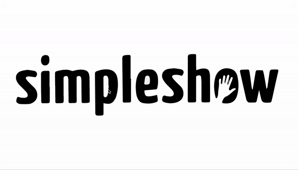

# Developer Assessment

This project is a technical test to apply for a developer position at [simpleshowinteractive.com](https://simpleshowinteractive.com/)

## Requirements

To run this project, please:

- Fork this repo
- Clone this repo
- In the terminal, run:

  ```
  yarn install
  yarn start
  ```

## Objective

Build an interactive app that supports Drag & Drop feature of the provided assets, using any technology, framework, or library. The assets consist of svg files of the background of a technical facility and a mech suit in pieces.The interaction is to have the user Drag & Drop each individual part of the mech suit until the full robot is complete.

## Result

I created the app using React for the logic and [gsap](https://greensock.com/gsap/) for the animation. I implemented the agile methodology known as kanban, hitting a Development time of 28 hours, you can view my board [here](https://trello.com/b/d3WIADe8/simpleshow-dev-test). The result looks like this:

<div style="display: flex; justify-content: center">
  
</div>

## Deployed Site

I used vercel to deploy the app to the world. You can visit it [here](https://simpleshow-dev-test.vercel.app).

## Contact me!

I'm open for bussiness, reach me on:

- Site: [adrio.now.sh](https://adrio.now.sh/)
- Email: [d-rio@outlook.com](https://d-rio@outlook.com/)
- Phone (Mexico): +52 55 3735 5309
- [LinkedIn](https://www.linkedin.com/in/adrio1992/)

## Developed in Mexico by Armando del Río (SPECTER-B)
